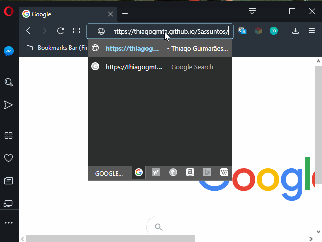

# Programação Básica para Web - CSS - Aula 01
> Esse projeto consiste em uma página web simples que aborda elementos iniciais do CSS.

Objetivos do projeto:

* Apresentação da Linguagem CSS e Integração ao HTML
* Links Importantes
* Fazendo uma estilização básica em nosso projeto



## Links Importantes

Alguns links que podem ser úteis para seu projeto web.

### Palettable

O palettable é um site que fornece paletas de cores harmônicas para seu projeto. Existem diversos sites do tipo disponíveis na web. O palettable é meu favorito.

Link: [Palettable](https://www.palettable.io)


## Fonts Google

O Fonts Google possibilita que você insira fontes externas em eu projeto. Basta selecionar as fontes desejadas e copiar o link de integração com seu projeto.

Link: [Fonts Goolge](https://fonts.google.com)


## Normalize

> Faça os Navegadores renderizarem seu projeto de forma mais consistente.

O objetivo do normalize é padronizar a renderização do seu site para diferentes navegadores.

Link: [Normalize](https://necolas.github.io/normalize.css/)


## CSS - Introdução

CSS é a linguagem que utilizaremos para criar a interface do nosso projeto. O HTML é a estrutura do site enquanto o CSS é o estilo. Essa linguagem vem mudando bastante com o tempo assim como o HTML e hoje encontra-se em sua terceira versão.

### CSS Em Linha

Uma das formas de se utilizar o CSS é inserindo-o diretamente no html através do atributo `style`. Esse atributo permite inserir qualquer propriedade Css em algum elemento html.

> Sua sintaxe é a seguinte:

````html
<p style="color:blue;">
    Um paragrafo com texto em azul!
</p>
````

> **Nota:** Utiliza-se CSS em linha em casos muito específicos. No geral recomenda-se a inserção de CSS em seu arquivo das duas maneiras a seguir.

### CSS Interno

No CSS interno utilizamos o elemento `<style> CSS Aqui! </style>` do html para inserção do CSS.

> Exemplo de utilização do CSS Interno:

````html
<!DOCTYPE html>
<html lang="pt-br">
<head>
	<title>Um pequeno Projeto </title>
    <meta charset="utf-8">
    <style>
        p {
            font-family: Arial, Verdana;
        }
    </style>
</head>
<body>
	<h1>Uma imagem vale mais que mil palavras </h1>

	<p>
        <cite>Uma imagem vale mais que mil palavras</cite> 
        é uma expressão popular de autoria do filósofo chinês Confúcio, 
        utilizada para transmitir a ideia do poder da comunicação através das imagens.
	</p>

</body>
</html>
````
> Nesse exemplo todo o código CSS pode ser inserido entre os elementos `<style> e </style>`.

### CSS Externo

É a forma mais comum de utilização do CSS onde todo seu código é inserido em um arquivo separado do HTML. Esse arquivo deve ser salvo com a extensão `.css` e referenciado no arquivo HTML através do elemento <link>.

> Imagine que nosso arquivo css está salvo em um diretório chamado `css` e o nome do arquivo é `estilo.css`. 
> Nesse caso o link entre o HTML e o CSS se daria da seguinte maneira:

````html
<head>
    <link rel="stylesheet" type="text/css" href="css/estilo.css"> 
</head>
````

### Elementos, Classes e ID

Em seu arquivo css é possível realizar a estilização de elementos CSS diretamente, de Classes ou de Identificadores (ID). Vejamos

**Elementos**

Para estilizar o conteúdo de um elemento html basta fazer referência a esse elemento dentro do arquivo CSS. Exemplo:

````css
body{
	font-family: Helvetica, Arial;
    color: #000000;
}
````
> Nesse caso estamos definindo o estilo da fonte do corpo da pagina e a cor de todo o texto.

**Classes**

Classes são blocos de instrução CSS que podem ser "chamadas" em qualquer elemento HTML. Normalmente uma classe CSS é criado com o intuito de ser utilizada repetidas vezes no código. Para criar uma classe basta dar um nome a ela precedido de ponto `.nomeDaClasse` Exemplo:

````css
.erro{
	font-weight: bold;
    color: red;
}
````
> Essa classe irá estilizar o texto deixando-o em negrito com a cor vermelha.

Para inserir a classe no elemento HTML basta utilizar o atributo `class`. Exemplo:

````html
<div class="erro">
    Ouve um erro no processo!
</div>
````

**ID**

Seletores funcionam da mesma maneira da Classe entretanto são referenciados pelo ID do elemento. Normalmente utiliza-se esse tipo de seletor para estilizar apenas um elemento específico, enquanto as Classes tem como premissa a reutilização em diversos elementos. Exemplo:

````css
#produto{
    background-color: #B8B8B8;
    color:#271F2A;
}
````

#### Elementos Filhos Indiretos e Diretos

Podemos criar blocos de estilo no CSS que tratem de elementos e seus elementos filhos (elementos dentro de outros elementos). Segue uma pequena descrição para cada caso.

**Elementos Filhos Indiretos**

Para esses casos pode-se criar blocos de formatação para o elemento pai e elementos que estejam dentro dele. Exemplo:

````css
header p{ 
	text-align: justify;
}
````
> Nesse exemplo estamos dizendo que: queremos que o texto de todos os parágrafos que estiverem dentro do elemento `<header>` apresentem-se justificados.

**Elementos Filhos Diretos**

No caso de elementos filhos diretos podemos criar uma restrição com o caractere `>` para essa utilização. Exemplo:

````css
header > p{ 
	text-align: justify;
}
````
> A alteração foi sutil. Mas nesse caso estamos criando uma formatação que será aplicada em parágrafos que estejam diretamente dentro do `<header>`. Parágrafos que estejam dentro de outros elementos (mesmo que dentro do `<header>`) não irão sofrer essa formatação. Exemplo:

````html
<header>
    <p> Esse paragrafo será apresentado de forma justificada </p>

    <div>
        <p> Esse paragrafo não será apresentado de forma justificada </p>
    </div>
</header>
````

## Acesse o projeto

Para acessar o projeto utilize os seguintes links:

GitHub: [GitHub](https://github.com/thiagogmta/5assuntos)
GitHubPages: [GitHubPages](https://thiagogmta.github.io/5assuntos/)
