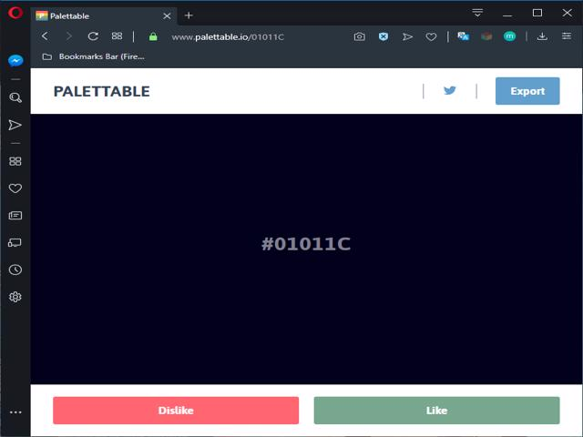

# Programação Básica para Web - CSS - Aula 01
> Esse projeto consiste em uma página web simples que aborda elementos iniciais do CSS.

Objetivos do projeto:

* Apresentação da Linguagem CSS e Integração ao HTML
* Links Importantes
* Fazendo uma estilização básica em nosso projeto

## Links Importantes

Alguns links que podem ser úteis para seu projeto web.

### Palettable



O palettable é um site que fornece paletas de cores harmônicas para seu projeto. Existem diversos sites do tipo disponíveis na web. O palettable é meu favorito.

Link: [Palettable](https://www.palettable.io)

## Fonts Google


O Fonts Google possibilita que você insira fontes externas em eu projeto. Basta selecionar as fontes desejadas e copiar o link de integração com seu projeto.

Link: [Fonts Goolge](https://fonts.google.com)

## Normalize


> Faça os Navegadores renderizarem seu projeto de forma mais consistente.

O objetivo do normalize é padronizar a renderização do seu site para diferentes navegadores.

Link: [Normalize](https://necolas.github.io/normalize.css/)

## CSS - Introdução

CSS é a linguagem que utilizaremos para criar a interface do nosso projeto. O HTML é a estrutura do site enquanto o CSS é o estilo. Essa linguagem vem mudando bastante com o tempo assim como o HTML e hoje encontra-se em sua terceira versão.

### CSS Em Linha

Uma das formas de se utilizar o CSS é inserindo-o diretamente no html através do atributo `style`. Esse atributo permite inserir qualquer propriedade Css em algum elemento html.

> Sua sintaxe é a seguinte:

````html
<p style="color:blue;">
    Um paragrafo com texto em azul!
</p>
````

> **Nota: ** Utiliza-se CSS em linha em casos muito específicos. No geral recomenda-se a inserção de CSS em seu arquivo das duas maneiras a seguir.

### CSS Interno

No CSS interno utilizamos o elemento `<style> CSS Aqui! </style>` do html para inserção do CSS.

> Exemplo de utilização do CSS Interno:

````html
<!DOCTYPE html>
<html lang="pt-br">
<head>
	<title>Um pequeno Projeto </title>
    <meta charset="utf-8">
    <style>
        p {
            font-family: Arial, Verdana;
        }
    </style>
</head>
<body>
	<h1>Uma imagem vale mais que mil palavras </h1>

	<p>
		<cite>Uma imagem vale mais que mil palavras</cite> é uma expressão popular de autoria do filósofo chinês Confúcio, utilizada para transmitir a ideia do poder da comunicação através das imagens.
	</p>

</body>
</html>
````
> Nesse exemplo todo o código CSS pode ser inserido entre os elementos `<style> e </style>`.

### CSS Externo

É a forma mais comum de utilização do CSS onde todo seu código é inserido em um arquivo separado do HTML. Esse arquivo deve ser salvo com a extensão `.css` e referenciado no arquivo HTML através do elemento <link>.

> Imagine que nosso arquivo css está salvo em um diretório chamado `css` e o nome do arquivo é `estilo.css`. 
> Nesse caso o link entre o HTML e o CSS se daria da seguinte maneira:

````html
<head>
    <link rel="stylesheet" type="text/css" href="css/estilo.css"> 
</head>
````

### Elementos, Classes e ID

#### Elementos Filhos diretos e Indiretos

## Contributing

1. Faça o _fork_ do projeto (<https://github.com/yourname/yourproject/fork>)
2. Crie uma _branch_ para sua modificação (`git checkout -b feature/fooBar`)
3. Faça o _commit_ (`git commit -am 'Add some fooBar'`)
4. _Push_ (`git push origin feature/fooBar`)
5. Crie um novo _Pull Request_

[npm-image]: https://img.shields.io/npm/v/datadog-metrics.svg?style=flat-square
[npm-url]: https://npmjs.org/package/datadog-metrics
[npm-downloads]: https://img.shields.io/npm/dm/datadog-metrics.svg?style=flat-square
[travis-image]: https://img.shields.io/travis/dbader/node-datadog-metrics/master.svg?style=flat-square
[travis-url]: https://travis-ci.org/dbader/node-datadog-metrics
[wiki]: https://github.com/seunome/seuprojeto/wiki
