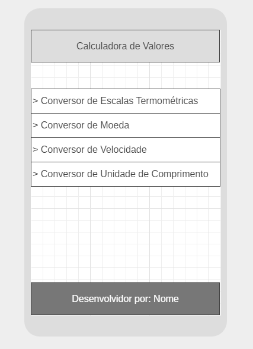
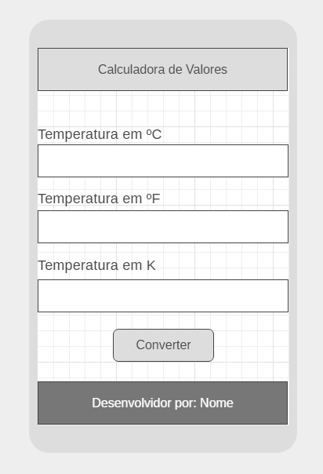

# JavaScript - Projeto Calculadora de Valores

> Vamos criar um projeto web com JavaScript visando implementar uma calculadora de conversão de valores.

Nosso projeto irá apresentar 4 opções ao usuário. Cada uma das opções apresenta uma calculadora com objetivo específico. A seguir a lista de opções do nosso projeto.

Para esse trabalho utilizaremos os conceitos iniciais de javascript adquiridos na aula passada e conceitos de estruturas condicionais que em JavaScript segue a mesma lógica e sintaxe da grande maioria das outras linguagens. Casso precise de uma consulta rápida pode encontrar no [W3Schools](https://www.w3schools.com/js/js_if_else.asp).

## Interface

> Descrição da Interface da aplicação.

Pense na sua interface como um aplicativo mobile.

A seguir um diagrama que representa a nossa proposta de aplicativo:

Na sequencia uma proposta de tela para a primeira opção da nossa aplicação:

----

## OPÇÕES DA APLICAÇÃO:

### 1. Conversor de Escalas Termométricas

> Esse módulo da aplicação deve permitir a conversão de temperaturas entre escalas diferentes.

Para esse módulo considere as escalas: Celsius; Fahrenheit e Kelvin. A aplicação deve disponibilizar ao usuário três campos de entrada de dados um para cada escala. A medida em que o usuário inserir um valor em uma determinada escala a aplicação deve retornar o valor convertido para as demais.

### 2. Conversor de Moeda

> Uma calculadora para conversão de Dólar em Real

Esse módulo deve disponibilizar ao usuário uma entrada de valor em dólar e outra entrada para a cotação do dólar no dia. Ao preencher as duas entradas retorne ao usuário a conversão daquele valor em Reais.

### 3. Conversor de Velocidade

> Um conversor de Milhas para Km

Apresente ao usuário uma entrada para Milhas e a aplicação deve apresentar seu valor proporcional em Quilômetros.

### 4. Conversor de Unidade de Comprimento

> Um conversor de Polegadas e Centímetros.

Apresente ao usuário uma entrada para Polegadas e a aplicação deve retornar seu valor em centímetros.

----

## Considerações Finais

Pesquise, caso necessário, as formulas de conversão das operações. **Não baixe códigos prontos para os problemas**. Procure escrever seu proprio código.
