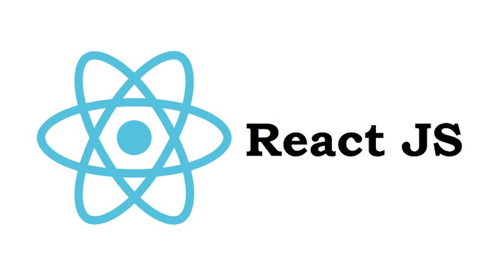

# Projeto: Frameworks

> Primeiro projeto da disciplina de Programação Básica para Web.

Esse projeto visa a utilização de alguns ***Frameworks*** bastante conhecidos com foco em desenvolvimento web.

Um ***Framework*** é uma espécie de caixa de ferramenta que auxilia o desenvolvedor a desenvolver seu trabalho de forma mais eficiente. O que um ***Framework*** faz, o desenvolvedor também pode fazer utilizando a tecnologia/linguagem crua. Entretanto, o custo dessa abordagem pode ser o tempo de produção. Não está em foco o debate de se utilizar o não ferramentas que automatizem determinadas funções. O propósito nesse ponto é saber que elas existem e recorrer à essas ferramentas quando necessário.

## Objetivos do Projeto

Apresentação de diversos frameworks focados em front-end com desenvolvimento prático de alguma funcionalidade em cada um deles.

## Que produto deve ser entregue

Cada grupo em seu tema deverá apresentar:

1. **O que é...**
   1. Do que se trata essa ferramenta? Quem a criou e por qual motivo?
   2. Que problema essa ferramenta resolve?
   3. Apresentação breve desse tópico!
2. **Para que serve...**
   1. Demonstrar um (ou alguns) pequenos exemplos de funcionamento da ferramenta.
   2. Pode ser exemplo de funcionamento prático local ou soluções de terceiros que foram alcançadas utilizando a ferramenta.
3. **Como funciona...**
   1. Apresentar um exemplo prático e replicável.
   2. Cada grupo deverá criar junto com a turma um exemplo simples de funcionamento da ferramenta abordada. A turma deve ser capaz de replicar o experimento apresentado em tempo real.

**Componentes**

Cada grupo deverá ter entre 3 e 4 componentes.

----

# Lista de Temas

### 1. Foundation

[Foundation](https://foundation.zurb.com/) é um framework para desenvolvimento de projetos front-end responsivos. A proposta do Foundation é ser "semântico, legível, flexível e completamente personalizável."

### 2. Materialize

[Materialize](https://materializecss.com/) é um framework moderno e responsivo baseado nas especificações do Google sobre Material Design.

### 3. Bootstrap

Provavlemente um dos frameworks front-end mais conhecidos o [boostrap](https://getbootstrap.com/) permite a criação de projetos responsivos com a essência ***mobile-first***.

### 4. Pure Css

O [Pure Css](https://purecss.io/) é um framework que fornece uma série de módulos CSS para criar diverssos elementos estilizados em seu projeto. O foco do Pure é ser extremamente leve e compacto. Suas linhas de código são cuidadosamente pensadas para que seu tamanho seja de poucos kb, ideal para performace.

### 5. AngularJs

Segundo a apresentação do projeto "o [Angular](https://angularjs.org/) permite que você estenda o vocabulário HTML para seu aplicativo. O ambiente resultante é extraordinariamente expressivo, legível e rápido de desenvolver."

### 6. ReactJs

[ReactJs](https://pt-br.reactjs.org/) faz com que a criação de UIs interativas seja uma tarefa fácil.  Crie views simples para cada estado na sua aplicação, e o React irá  atualizar e renderizar de forma eficiente apenas os componentes  necessários na medida em que os dados mudam

### 7. VueJs

[VueJs](https://vuejs.org/). Vue (pronuncia-se /vjuː/, como **view**, em inglês) é um **framework progressivo** para a construção de interfaces de usuário. Ao contrário de outros *frameworks* monolíticos, Vue foi projetado desde sua concepção para ser adotável incrementalmente. 

### 8. NodeJs

[NodeJs](https://nodejs.org/en/) é um interpretador de JavaScript assíncrono com código aberto orientado a eventos focado em migrar a programação do Javascript do cliente (frontend) para os servidores.

#

## Critérios

Os critérios do projeto são:

- Apresentação clara e concisa da definição da ferramenta. Caso seja utilizado slides que seja para apoio e não para leitura.
- Apresentação de exemplos de funcionamento da ferramenta.
- Aplicação de um exemplo prático da utilização da ferramenta com a turma.
